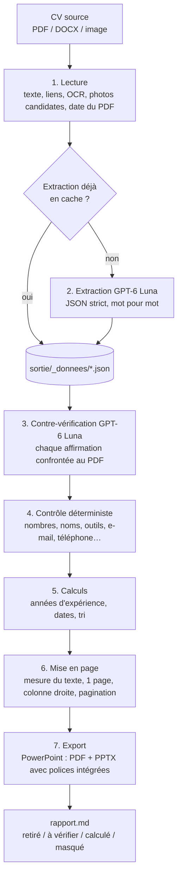

# CV Formatter Logiclever

Outil qui transforme les CV de consultants (PDF, Word, images scannées) en **CV au format Logiclever** :
un **PowerPoint modifiable** et un **PDF prêt à envoyer** par consultant, photo comprise quand le CV en contient une.

> **Règle d'or : l'outil n'invente rien.** Chaque information affichée vient du CV d'origine et a été
> vérifiée deux fois (contrôle automatique + contre-vérification par le modèle). Ce qui ne peut pas être
> retrouvé dans le CV est retiré, et tout ce qui a été retiré, signalé, calculé ou masqué est listé dans un rapport.

Ce projet a été entièrement conçu et codé avec **Claude Code**. Ce document explique comment il fonctionne,
les choix qui ont été faits, et la logique suivie à chaque étape, pour pouvoir le maintenir et le faire évoluer.

---

## Sommaire

1. [Utilisation (équipe commerciale)](#1-utilisation-équipe-commerciale) — sur le poste, ou [en ligne](#version-en-ligne-google-cloud-run)
2. [Vue d'ensemble : comment ça marche](#2-vue-densemble--comment-ça-marche)
3. [Le détail de chaque étape](#3-le-détail-de-chaque-étape)
4. [Choix de conception et raisons](#4-choix-de-conception-et-raisons)
5. [Données, cache et corrections manuelles](#5-données-cache-et-corrections-manuelles)
6. [Architecture du code et points de réglage](#6-architecture-du-code-et-points-de-réglage)
7. [Comment le projet a été construit et validé](#7-comment-le-projet-a-été-construit-et-validé)
8. [Coût, confidentialité, sécurité](#8-coût-confidentialité-sécurité)
9. [Limites connues](#9-limites-connues)
10. [Dépannage](#10-dépannage)

---

## 1. Utilisation (équipe commerciale)

### Version en ligne (Google Cloud Run)

Rien à installer : on ouvre l'adresse du service, on se connecte avec son compte Google **@logiclever.com**, on
dépose les CV (PDF, Word, images ou `.zip` d'un dossier Drive), on choisit la version nominative, anonyme ou les
deux, puis on télécharge chaque PDF et PowerPoint, ou tout le lot en `.zip`, avec le détail du contrôle affiché
pour chaque CV. Les lots restent dans l'historique 30 jours puis sont supprimés.

Même programme que la version Windows ; le PDF y est produit par LibreOffice, calé sur le rendu de PowerPoint
(voir [3.11](#311-rendu-pdf-sous-linux--calage-sur-powerpoint)). Déploiement, coût et administration :
**[deploiement/README.md](deploiement/README.md)**.

### Installation sur un poste Windows (une seule fois par poste)

1. Installer **Python 3.11+** depuis <https://www.python.org> (cocher « Add Python to PATH »).
2. Double-cliquer sur **`Installer.bat`** : installe les composants Python et les polices Lexend
   (sans droits administrateur), puis ouvre le fichier `.env`.
3. Dans `.env`, coller la clé OpenAI après `OPENAI_API_KEY=` et enregistrer.
4. Fermer PowerPoint s'il était ouvert (pour qu'il voie les polices Lexend).

PowerPoint (ou, à défaut, LibreOffice) doit être installé pour produire les PDF.

### Au quotidien

1. Déposer les CV (PDF, Word, images, exports LinkedIn « Enregistrer au format PDF », ou un `.zip` Google
   Drive) dans le dossier **`Input`** du projet (créé automatiquement au premier lancement).
2. Double-cliquer sur **`Formater les CV.bat`** (on peut aussi glisser-déposer des fichiers ou dossiers sur le `.bat`).
3. Résultats dans **`sortie/`** :
   - `CV Logiclever - Prénom NOM.pptx` (modifiable) et `.pdf` (à envoyer) ;
   - **`rapport.md`** : pour chaque CV, ce qui a été retiré, ce qui est à vérifier, comment la pastille
     d'expérience a été calculée, ce qui a été masqué faute de place — **à lire avant tout envoi**.

**Version anonyme** : `Formater les CV (anonymes).bat` → dossier `sortie anonyme/` (initiales, pas de photo,
ni e-mail, ni téléphone, ni LinkedIn ; la ville et le titre sont conservés).

### Ligne de commande

```
python -m cv_formatter [dossiers | fichiers | .zip] [options]
```

| Option | Effet |
|---|---|
| *(aucune entrée)* | traite le dossier `Input` du projet (CV et `.zip` qu'il contient) |
| `--anonymiser` | CV anonyme : initiales, ni photo, ni e-mail/téléphone/LinkedIn ; nom retiré du texte, des noms de fichiers et des métadonnées |
| `--sans-coordonnees` | retire e-mail, téléphone, localisation et LinkedIn (nom et photo conservés) |
| `--pages-max N` | nombre de pages maximal (défaut : 1 page si le CV d'origine tient sur une page, sinon pages de suite réservées aux expériences) |
| `--depuis-json` | régénère **sans appeler l'API**, à partir des extractions enregistrées (après correction manuelle) |
| `--forcer` | ré-extrait les CV même s'ils ont déjà été traités |
| `--sans-controle` | désactive la contre-vérification (second appel au modèle) |
| `--sans-pdf` | ne produit que les PowerPoint |
| `--sortie DOSSIER` | dossier de sortie (défaut : `sortie`) |
| `--modele`, `--effort` | modèle OpenAI (défaut `gpt-6-luna`) et effort de raisonnement (défaut `high`) |
| `--template FICHIER.pptx` | autre modèle PowerPoint (champs repérés par leurs balises `{{…}}`) |
| `--donnees DOSSIER`, `--cache-par-empreinte`, `--photos DOSSIER` | emplacement des extractions enregistrées (rangées par empreinte du CV plutôt que par nom de fichier) et des photos — utilisés par le service en ligne |

---

## 2. Vue d'ensemble : comment ça marche

Le principe : **le modèle d'IA lit et structure, le code décide**. Le LLM (GPT-6 Luna) ne sert qu'à
comprendre des CV aux mises en page très variées et à en extraire le contenu dans un format strict.
Tout le reste — vérification, calculs, mise en page, photo, export — est du code déterministe, mesurable et
reproductible.



Chaque CV passe par ces étapes indépendamment ; une erreur sur un CV n'arrête pas le lot.
Les extractions et contre-vérifications sont mises en cache : relancer l'outil ne rappelle pas l'API
tant que le CV source n'a pas changé.

---

## 3. Le détail de chaque étape

### 3.1 Lecture du CV source — `pdf_source.py`, `ocr.py`

- **Conversion** : Word/ODT/RTF → PDF via LibreOffice (Word en secours) ; images → PDF via PyMuPDF.
- **Texte** : extrait deux fois (ordre du flux PDF + ordre de lecture), car les CV multi-colonnes mélangent
  l'ordre du texte. Normalisation : ligatures, accents LaTeX séparés (« Ing´enieur » → « Ingénieur »).
- **Liens hypertextes** du PDF : récupèrent par exemple l'URL LinkedIn cachée derrière une icône.
- **OCR** : une page avec moins de 40 caractères de texte mais des images est considérée comme scannée →
  OCR intégré de Windows (français), Tesseract en secours. Le texte OCR est marqué « peu fiable » : les
  contrôles signalent au lieu de retirer (une erreur d'OCR ne doit pas faire disparaître une information vraie).
- **Date du document** (métadonnées PDF) : sert à avertir quand un CV a plus d'un an.
- **Photos candidates** : images des pages 1–2 ayant une taille et des proportions de portrait (voir 3.7).

### 3.2 Extraction par GPT-6 Luna — `extraction.py`, `schema.py`

- **API** : OpenAI Responses API, `client.responses.parse(..., text_format=CV)` → sortie **JSON strict**
  validée par Pydantic. Le PDF est envoyé tel quel (le modèle voit le texte **et** l'image de chaque page),
  avec en complément le texte extrait, les liens et les vignettes des photos candidates.
- **Schéma** (`schema.py`) : tous les champs sont obligatoires mais peuvent valoir `null`/liste vide. C'est ce
  qu'exige le mode strict, et cela oblige le modèle à dire explicitement « absent » au lieu d'inventer.
  Les descriptions des champs font partie de la consigne (ex. : TOEIC → langues, pas certifications).
- **Consigne** (`SYSTEM_PROMPT`) : ne rien inventer ni déduire ; reprendre le texte **mot pour mot** (seules
  corrections permises : fautes évidentes, accents cassés, casse, ponctuation) ; tout en français (traduction
  fidèle si besoin, noms propres et outils conservés) ; le texte visible prime sur les liens ; classer
  rigoureusement alternances et stages ; ne jamais présenter un souhait (« je cherche… ») comme une compétence.
- **Employeur et client** (section dédiée de la consigne) : l'employeur est l'organisation nommée dans le bloc de
  l'expérience (ou le titre de rubrique qui regroupe ses missions), jamais celle de l'en-tête, du titre, du logo,
  des coordonnées ou du pied de page — un CV mis en forme par une ESN (Logiclever comprise) ne fait pas de cette
  ESN l'employeur des expériences listées. Le client n'est renseigné que si le CV le distingue explicitement
  (« Client : B », « B (via A) », ligne client sous « A - poste »). Freelance : client = l'entreprise de la mission.
  Plusieurs missions non datées sous un même emploi : une seule entrée, clients listés, intitulés de mission en
  sous-titres ; un poste qui a ses propres dates reste une entrée séparée.
- **Exports LinkedIn** : `pdf_source.linkedin_roles` lit la structure entreprise → postes d'après les tailles de
  police (LinkedIn n'écrit le nom de l'entreprise qu'une fois au-dessus de tous ses postes) ; elle est fournie au
  modèle et sert de contrôle (cf. 3.3).
- `reasoning={"effort": "high"}`, `store=False` (pas de conservation côté OpenAI).
- **Cache** : le résultat est enregistré dans `sortie/_donnees/<nom du fichier>.json` avec l'empreinte SHA-256
  du CV source ; il est ré-extrait si le CV change, avec `--forcer`, ou quand `EXTRACTION_VERSION` change
  (nouvelle consigne) — sauf JSON corrigé à la main, dont les corrections priment.

### 3.3 Garde-fou n°1 : contrôle déterministe — `verification.py`

Chaque information extraite est recherchée dans le texte du CV d'origine (casse et accents ignorés).

| Règle | Exemple de ce qui est attrapé |
|---|---|
| Tout **nombre** (date, %, montant, effectif) doit exister dans le CV | « 7 équipes » alors que le CV dit 2 |
| Tout **sigle**, mot en **CamelCase**, **nom propre** en milieu de phrase doit exister | une certification « PMP » absente du CV |
| **E-mail** présent dans le texte visible ; **téléphone** (9 derniers chiffres) ; **LinkedIn** dans le texte ou les liens | un e-mail tiré d'un lien qui n'est pas celui du candidat |
| Années de début/fin présentes dans la période écrite ; dates relues par le code (`contenu.parse_period`) | une date décalée d'un an ; « Jan – Déc 2021 » lu « 2021 → 2021 » |
| Employeur / client nommés ailleurs que dans l'en-tête (nom, titre), les e-mails/URL et les pieds de page répétés (`SourceDocument.body_text`) ; nom d'entreprise contrôlé mot par mot, premier mot compris | « Logiclever » pris dans le titre « Consultant confirmé Logiclever » → employeur retiré, le client devient l'entreprise |
| Export LinkedIn : chaque poste a l'entreprise sous laquelle LinkedIn le liste | un 2e poste attribué au client cité dans sa description |
| « Freelance » affiché seulement si le CV écrit freelance / indépendant / portage | une mention Freelance inventée |
| CV en français : moins de 60 % des mots retrouvés → « à vérifier » | une reformulation trop libre |

Tolérances voulues : correspondance approchée ≥ 0,85 (fautes corrigées : « Microsft » → « Microsoft »),
formes collées (« Power BI » = « PowerBI »), texte collé dans le PDF (« de140 » = « de 140 »), nombres écrits
en lettres (« trois » = 3), suffixes (« 3ème » = « 3ième »).

**Décision** : introuvable → l'élément est **retiré** (une puce, un outil, une certification…) ; pour un champ
d'une expérience (poste, entreprise, lieu), seul ce champ est vidé. Si le texte de référence est incertain
(OCR) ou si le JSON a été **modifié à la main**, rien n'est retiré : tout est seulement signalé.

### 3.4 Garde-fou n°2 : contre-vérification par le modèle — `controle.py`

Un second appel GPT-6 Luna reçoit le PDF et la liste numérotée de toutes les affirmations extraites
(poste + employeur + dates, chaque puce, chaque outil, certification, diplôme, langue, années d'expérience…)
et répond pour chacune : `confirme`, `absent` ou `inexact`.

- Les CV partent souvent sans relecture : une affirmation contestée est **retirée ou corrigée**, pas seulement
  signalée.
- `absent` ou `inexact` sur un élément atomique (puce, outil, certification, formation…) → **retiré**.
- L'en-tête de chaque expérience est contrôlé champ par champ (poste, dates, employeur, client, lieu) : un champ
  contesté est vidé ; une expérience entière n'est jamais retirée. Employeur non nommé dans l'expérience → retiré,
  et le client (que le bloc nomme) devient l'entreprise affichée.
- Langue et niveau sont contrôlés à part : un niveau contesté ne retire pas la langue.
- **Nature** (alternance/stage) : affirmation formulée « le CV ne présente pas cette expérience comme une
  alternance ou un stage ». Si le modèle la juge `inexact`, l'expérience est **exclue du calcul des années**
  et signalée — elle n'est jamais retirée.
- **Photo** : si une photo a été retenue, sa vignette est jointe et le modèle dit s'il s'agit bien d'un visage
  (et non d'un logo ou d'un badge) — utilisé par le contrôle de la photo (3.7).
- Un projet entier contesté → seulement signalé.
- Les identifiants renvoyés sont normalisés (le modèle les recopie parfois avec leurs crochets, « [E0] »).
- Les verdicts sont mis en cache dans le JSON (empreinte des données + `CONTROLE_VERSION`).

Ce second regard attrape ce que le contrôle par mots-clés ne peut pas voir : une réalisation rattachée à la
mauvaise expérience, un employeur déduit (un nom présent dans le titre mais pas pour la mission), un souhait
présenté comme une compétence.

### 3.5 Années d'expérience (pastille) — `contenu.py`

La pastille « N ans d'expérience » affiche des années **prouvées par les dates du CV** :

1. **Comptent** : emploi, mission, freelance, création d'entreprise.
   **Ne comptent pas** : alternance, stage, bénévolat, jobs étudiants (tutorat…), projets.
   Une mention « alternance », « apprentissage » ou « stage » dans l'intitulé, le contexte ou la période
   l'emporte sur la classification du modèle.
2. **Union des périodes** : les chevauchements ne comptent qu'une fois, les **trous ne comptent pas**.
3. Poste « en cours » : compté **jusqu'à aujourd'hui** ; si le CV a plus d'un an, un avertissement demande de
   vérifier qu'il est toujours d'actualité.
4. Dates à l'année seule : « 2020 – 2022 » = 2 ans ; face à une date au mois près, l'année seule est lue au
   milieu de l'année.
5. **Arrondi à l'année supérieure** dès qu'au moins un mois d'expérience est prouvé (33 mois → 3 ans) ;
   aucune expérience prouvée → pas de pastille.
6. Si le CV **écrit** un nombre d'années, il est **vérifié** : si les dates en justifient moins, c'est le nombre
   justifié qui s'affiche (« le CV annonce 8 ans mais ses dates n'en justifient que 6 ») ; si les dates en
   justifient autant ou plus, c'est le nombre écrit qui s'affiche (jamais plus que ce que le consultant annonce) ;
   si le CV n'a pas de dates, le nombre écrit est gardé et signalé « à confirmer ».

Le détail du calcul (mois retenus, expériences exclues et pourquoi) figure dans le rapport.

### 3.6 Mise en page — `layout.py`, `render_pptx.py`, `contenu.py`

**Le modèle.** L'outil utilise une copie nettoyée du modèle Google Slides (`assets/modele_cv_logiclever.pptx`,
83 Ko au lieu de 6 Mo : mises en page et images inutilisées retirées, sous-ensembles de polices supprimés).
Les zones sont repérées par leurs balises (`{{nom}}`, `{{experiences}}`, `{{si}}`…), les titres de section
par leur texte, les icônes de coordonnées par proximité ; le modèle peut donc évoluer sans changer le code.

**Mesure du texte.** PowerPoint ne calcule pas la hauteur du texte pour nous. Chaque mot est mesuré avec les
vraies polices Lexend (`pymupdf.Font.text_length`) et la césure est reproduite ligne par ligne.
Le modèle a été **calibré sur le rendu réel de PowerPoint**, dont il reprend les règles :
- interligne = 1,2 × taille × espacement, ligne de base à 0,96 em sous le haut de la ligne ;
- tous les espaces comptent : PowerPoint ne fusionne pas les espaces consécutifs (« Scrum  ·  SAFe ») ;
- l'espace avant d'un paragraphe est arrondi au point entier (1,6 pt → 2 pt) : la réduction de police arrondit
  de même ;
- le texte rendu est jusqu'à 0,75 % plus large que calculé (tailles arrondies au 1/600 de pouce : 8 pt rendu à
  8,04 pt) : marge de 1 % sur la largeur. La hauteur, elle, est exacte ; une marge de 0,5 % reste pour les
  imprévus (glyphe absent de Lexend rendu dans une autre police…).

Contrôle : PowerPoint, interrogé sur la hauteur réelle du texte de chaque zone des 14 CV de test (75 zones),
ne signale aucun débordement. C'est ce qui permet de garantir qu'un texte tient dans sa zone sans le vérifier
à l'œil.

**Titres de section et alignements.**
- Icône calée sur la marge du texte de sa colonne et **centrée sur la hauteur de capitale du titre** (le modèle
  Google Slides donnait au titre un espace après de 12 pt qui le faisait remonter : l'icône paraissait 2,5 mm
  trop basse). Titre à 1,3 cm du bord de l'icône dans les deux colonnes, aligné sur le texte des coordonnées.
- Même rythme vertical partout : 1,05 cm du haut d'un titre à son contenu, 0,3 cm entre la fin d'une section et
  le titre suivant ; un titre est ainsi plus proche de son contenu que de la section précédente.
- Listes en ligne (« SAP · Jira · … ») : espaces insécables avant le point, une ligne ne commence jamais par « · ».

**En-tête.**
- Nom « Prénom NOM » : sur une ligne de préférence (37 → 28 pt), sinon deux lignes (jusqu'à 22 pt), puis trois.
- Titre du consultant ajouté sous le nom (le modèle n'a pas de champ titre) : ≤ 2 lignes, raccourci au premier
  séparateur (« — », « | »…) s'il est trop long, en dernier recours tronqué avec « … » visible.
- Pastille d'expérience : élargie si besoin ; supprimée s'il n'y a rien de prouvé.
- Coordonnées : lignes absentes supprimées avec leur icône, les autres restent groupées et centrées sur
  l'emplacement du bloc ; icônes sur l'axe des icônes de section, centrées sur leur ligne ; police réduite pour
  tenir sur une ligne ; **e-mail et LinkedIn cliquables** (lien posé sur la zone, pour garder le texte noir non
  souligné du modèle).
- Photo : détachée du bord de la feuille, alignée sur la marge du texte et sur le bas de la pastille ; sans
  photo, le nom s'aligne sur la marge du texte de la colonne gauche.

**Colonne de droite** (Compétences → Certifications → Formation) : empilée selon la hauteur réelle du contenu.
Elle reste **toujours sur la page 1** : police réduite jusqu'à 75 %, puis masquage des spécialités de
formation, puis des derniers éléments des listes les plus longues (en gardant des minimums : 5 outils,
2 certifications, 3 domaines d'expertise…). Tout ce qui est masqué est listé dans le rapport.
Blocs : Expertise, Langues, SI & outils (logiciels, plateformes, technologies et méthodologies) ; une norme ou réglementation n'entre dans Expertise que si le CV la présente comme compétence (pas si elle est seulement citée dans une réalisation).
Il n'y a plus de bloc Méthode (peu d'information dans la plupart des CV). Un bloc Expertise ou SI & outils de
moins de 3 éléments n'est pas affiché (il mettrait en avant des détails).

**Expériences** : poste, puis « Employeur · Client : X · Lieu » (le client est toujours libellé), période avec
la mention Alternance / Stage / Freelance, puis réalisations ; les intitulés de mission sont en sous-titres
gras. La ligne « Environnement » n'est plus affichée.

**Colonne gauche** (expériences) et **règle d'une page** :
- **Une page par défaut** si le CV d'origine tient sur une page : police réduite jusqu'à 80 %, puis bénévolat
  retiré, projets condensés puis retirés, puis puces masquées en partant des expériences les plus anciennes
  (les deux plus récentes restent complètes). Ce qui est masqué libérant souvent plus de place que nécessaire,
  la police est ensuite agrandie autant que la page le permet (comme pour la colonne de droite).
- **Pages de suite** uniquement si le CV d'origine fait plusieurs pages (ou s'il est impossible de tenir sur une
  page même condensé), et **seulement pour les expériences** — jamais pour les compétences ou la formation.
  Une dernière page remplie à moins de 30 % est évitée en condensant comme pour un CV d'une page (cas des
  exports LinkedIn, qui font plusieurs pages pour peu de contenu).
  Titre « Expériences (suite) », expérience coupée avec rappel « … (suite) », titres jamais orphelins en bas de
  page, paragraphe démesuré découpé au mot.
- Rien n'est réécrit ni résumé : on réduit, on masque des détails, et on le dit.

**Typographie** : nettoyage des puces (puce parasite, ponctuation finale, majuscule initiale sans toucher aux
graphies de marque comme « spaCy » ou « eMI3 ») ; titres, postes et diplômes saisis en MAJUSCULES remis en casse
normale en gardant les sigles (« CHEF DE PROJET SI JUNIOR » → « Chef de projet SI junior ») — jamais les noms
d'entreprise ; périodes en français (« Juin 2022 – Aujourd'hui ») si elles concordent avec le texte du CV, sinon
le texte du CV tel quel ; expériences triées de la plus récente à la plus ancienne ; une formation également
rangée en certification n'est affichée qu'une fois.

### 3.7 Photo — `pdf_source.py`

1. **Candidates** : images de 60 px minimum, proportions 0,55–1,8, occupant 0,2 % à 15 % de la page.
2. **Choix** : le modèle reçoit les vignettes et indique laquelle est le visage du consultant (ou aucune).
3. **Recadrage sur la zone réellement visible** : la page est rendue avec et sans l'image ; la différence des
   pixels donne exactement ce que l'on voit dans le CV — y compris pour une photo **pivotée**, rognée en
   **cercle** ou **détourée**. Forme irrégulière (ovale, « galet ») : plus grand cercle de la forme qui contient
   tout le visage (repéré par le détecteur), sinon forme d'origine conservée — jamais de visage coupé. Puis
   recadrage carré (haut privilégié pour un portrait vertical), JPEG 800 px.
4. **Contrôle du visage** (`visage.py`) : la photo retenue passe dans un détecteur de visage local (YuNet
   d'OpenCV, modèle de 230 Ko sous licence MIT fourni dans `assets/`) — gratuit, hors ligne, indépendant du LLM.
   Le visage doit être net (confiance ≥ 60 %) et assez grand (≥ 12 % de la largeur).
   - visage détecté → photo gardée (signalée si le modèle a un doute) ;
   - pas de visage détecté mais confirmé par le modèle → gardée et signalée ;
   - ni détecté ni confirmé → **retirée** et signalée : un logo dans le cadre photo est pire qu'une absence de photo
     (sauf JSON corrigé à la main : gardée et signalée).
   - aucune image retenue alors qu'une image écartée contient un visage → signalé.
5. **Rapport** : la vignette de la photo utilisée — ou de l'image retirée — est affichée sous la ligne « Photo ».

### 3.8 Export et polices — `export_pdf.py`, `fonts.py`

- Le modèle Google Slides n'embarque que des **sous-ensembles** de Lexend : sans la police installée, PowerPoint
  remplacerait des caractères. `fonts.py` télécharge Lexend (licence SIL OFL, fichier `OFL.txt` joint) et
  l'installe **pour l'utilisateur** (registre HKCU, sans droits administrateur).
- **PowerPoint** (COM, une seule session pour le lot) enregistre le **PDF**, puis ré-enregistre le **PPTX avec les
  polices complètes intégrées** : le PowerPoint s'affiche correctement même sur un poste sans Lexend.
- **Sans PowerPoint** (serveur Linux, ou poste sans PowerPoint) : **LibreOffice**, à partir d'une copie calée sur
  le rendu de PowerPoint (3.11), puis polices intégrées au PPTX par l'outil lui-même, au format EOT des fichiers
  `ppt/fonts/*.fntdata` (`fonts.embed_in_pptx`). Vérifié avec une police absente du poste : PowerPoint l'affiche
  depuis le PPTX, dans ses quatre graisses.

### 3.9 Anonymisation — `anonymisation.py`

Initiales à la place du nom (titre conservé) ; pas de photo, d'e-mail, de téléphone ni de LinkedIn (la ville
reste) ; nom, e-mails, téléphones et URL LinkedIn effacés de **tout** le texte ; métadonnées neutres ;
fichiers nommés « CV Logiclever - N. A. - Titre (anonyme) ». Les noms d'employeurs et de clients sont
conservés (pratique habituelle d'un dossier de compétences).

### 3.10 Rapport — `rapport.py`

`rapport.md`, un bloc par CV : fichiers produits, origine de l'extraction, contre-vérification, photo, calcul
de la pastille, sections non reprises (hobbies, « À propos »…), ajustements de mise en page, avertissements,
**éléments retirés** et **éléments à vérifier** avec la raison de chacun. `rapport.json` : même contenu, structuré
(affiché par la page web).

### 3.11 Rendu PDF sous Linux : calage sur PowerPoint — `libreoffice.py`

Sur le serveur (Linux), il n'y a pas de PowerPoint : le PDF est produit par LibreOffice. Le PPTX, lui, est
**identique octet pour octet** à celui produit sous Windows (la mise en page ne dépend pas du système) ; seul le
moteur qui le transforme en PDF change. Or LibreOffice ne place pas le texte comme PowerPoint. Mesuré sur les
14 CV de test, sans correction :

| Écart LibreOffice brut / PowerPoint | Cause |
|---|---|
| texte jusqu'à 0,8 % plus étroit : une ligne pleine accueille un mot de plus, tout ce qui suit remonte d'une ligne (4 mm) | tailles arrondies au 1/100 mm (et non au 1/600 de pouce) |
| première ligne de chaque zone 0,1 à 0,6 mm plus bas, interligne arrondi (jusqu'à 0,8 mm cumulés en bas de colonne) | interligne « indépendant de la police » de LibreOffice, ligne de base à 80 % de la hauteur de police |
| puces 0,23 mm trop hautes ; police de remplacement sans Arial | puce placée avec les métriques de sa propre police |
| texte de la pastille 1,4 mm trop bas | marge interne des rectangles à coins arrondis |

**Méthode.** Une diapositive de calibrage, construite avec le code de production (mêmes zones, styles et
interlignes que les CV, 6,5 à 37 pt), est rendue par PowerPoint et par LibreOffice ; les lignes de base sont
relevées dans les deux PDF. On en tire :
- **la position de la ligne de base PowerPoint** selon l'interligne (`config.POWERPOINT_BASELINE`, de 0,84 à
  1,04 em), puis le modèle complet (interligne 1,2 × taille × facteur, espaces avant en points entiers, ancrage
  haut / milieu / bas) : validé sur les PDF PowerPoint des 14 CV, **1 023 lignes à 0,044 mm près** ;
- **la règle de LibreOffice** pour un interligne exact : ligne de base = haut de ligne + hauteur − (hauteur de
  police − 80 %), au 1/100 mm ; conversion des points en 1/100 mm identique à celle de son code source.

**Correction.** Le PDF est produit à partir d'une **copie** du PPTX (le PPTX livré, modifiable, n'est pas touché) :
chaque ligne calculée par le modèle de mise en page — celui qui a dimensionné les zones — devient un paragraphe
d'interligne exact, calculé pour que sa ligne de base tombe là où PowerPoint la place ; la puce devient un
caractère Arial dont l'espacement porte le texte au retrait ; la marge des coins arrondis est prise en compte ;
Liberation Sans (métriques d'Arial) est installée dans l'image.

**Résultat** (14 CV de test, PDF LibreOffice sous Linux comparés aux PDF PowerPoint sous Windows) :

| | Avant calage | Après calage |
|---|---|---|
| Lignes de base | +0,30 mm en moyenne, jusqu'à 0,66 mm | **0,002 mm en moyenne, 0,05 mm au plus** |
| Puces | 0,23 mm trop hautes | **0,04 mm au plus** |
| Pastille, titres de section | 1,4 mm / 0,24 mm | **< 0,05 mm** |
| Césure | lignes et blocs décalés d'une ligne | **96 % des lignes identiques** (voir ci-dessous) |

Les 4 % restants sont des lignes où PowerPoint loge un mot de plus que le modèle, qui garde 1 % de marge de
largeur (ou coupe après un trait d'union : « Île-/de-France ») : sous Linux, la césure est celle que le modèle a
prévue en dimensionnant la zone, sans débordement ni espace laissé vide. Les fins de ligne peuvent aussi différer
de quelques dixièmes de millimètre (texte LibreOffice un peu plus étroit), sans effet sur la mise en page
(texte aligné à gauche, césure imposée).

**Contrôles** : `tests/test_libreoffice.py` (structure et arithmétique de la copie calée, partout) et
`tests/test_rendu_linux.py` (rendu LibreOffice réel comparé au modèle PowerPoint, ligne par ligne, dans l'image
Docker : écart maximal mesuré 0,011 mm). À relancer après toute mise à jour de l'image. Pour recalibrer (nouvelle
version de PowerPoint ou de LibreOffice) : `outils/calibrage_libreoffice.py`.

Autres différences Linux, vérifiées : OCR par **Tesseract** (français) au lieu de l'OCR de Windows — 96 % des mots
d'un CV scanné retrouvés, contre 97 % ; conversion Word → PDF par LibreOffice Writer.

---

## 4. Choix de conception et raisons

| Choix | Pourquoi | Alternative écartée |
|---|---|---|
| LLM pour lire, code pour tout le reste | Les CV ont des mises en page imprévisibles (Canva, LaTeX, Word, multi-colonnes) ; le reste doit être exact et reproductible | Analyse par règles (impossible à généraliser) ; tout confier au LLM (non vérifiable) |
| GPT-6 Luna | Seul accès LLM disponible ; ~20× moins cher que GPT-6 Sol, lit les PDF (texte + images), JSON strict | GPT-6 Sol (trop cher pour l'usage) |
| Sortie JSON stricte + champs « nullables » | Force le modèle à déclarer l'absence d'une information au lieu de l'inventer | Texte libre à analyser |
| Deux garde-fous indépendants | Le contrôle par mots-clés attrape les chiffres et noms inventés ; le modèle attrape les rattachements et déformations | Un seul niveau de contrôle |
| Retirer plutôt que corriger, signaler plutôt que retirer en cas de doute | Ne jamais présenter au client une information non prouvée, sans pour autant perdre une information vraie | Corrections automatiques |
| Années d'expérience calculées par le code | Les LLM calculent mal les dates ; règles explicites, vérifiables et expliquées dans le rapport | Laisser le modèle compter |
| Une page, pages de suite réservées aux expériences | Demande de l'équipe commerciale : un CV client se lit en une page | Pagination libre |
| Réduire / masquer, jamais résumer | Résumer, c'est reformuler, donc risquer d'inventer | Résumés automatiques |
| Mesure du texte avec les vraies polices, calibrée sur PowerPoint | Garantit l'absence de débordement sans intervention | Ajustement automatique de PowerPoint (non appliqué aux fichiers générés, rendu imprévisible) |
| Photo par différence de rendu | Fidèle à ce qui est visible (rotations, cercles, détourages) | Extraire l'image brute (souvent pivotée ou beaucoup plus grande que la partie visible) |
| Cache des extractions | Coût et temps : un CV n'est envoyé qu'une fois ; corrections manuelles possibles | Ré-extraction à chaque lancement |
| Copie nettoyée du modèle, champs repérés par balises | Fichiers légers ; le modèle peut évoluer sans toucher au code | Positions codées en dur |
| Polices installées + intégrées par PowerPoint | Rendu identique partout, PDF comme PPTX | Laisser les sous-ensembles du modèle (glyphes manquants) |
| Contrôle de la photo par un détecteur local + l'avis du modèle | Deux regards indépendants ; un logo ou un badge ne finit jamais dans le cadre photo | Faire confiance au seul choix du modèle |
| Liens posés sur la zone de texte | Cliquables dans le PDF sans le soulignement bleu imposé par PowerPoint | Lien sur le texte (souligné, hors charte) |
| OCR Windows puis Tesseract | Déjà présent sur tous les postes Windows, français, hors ligne, gratuit | Service d'OCR en ligne |
| PDF sous Linux : copie du PPTX calée sur PowerPoint, rendue par LibreOffice | Pas de PowerPoint sous Linux ; mêmes positions que PowerPoint à 0,05 mm près, PPTX livré inchangé | LibreOffice sans calage (lignes décalées, césure différente) ; dessiner le PDF soi-même (second moteur de rendu à maintenir) ; conversion par Microsoft 365 (compte et données hors de Google Cloud) |
| En ligne : Cloud Run (service web + job par lot), bucket monté comme dossier | Rien ne tourne entre deux lots (coût quasi nul) ; le job continue si l'on ferme la page ; LibreOffice, polices et OCR dans l'image | Cloud Functions (ni LibreOffice ni polices, durée limitée) ; machine virtuelle permanente (payante même inutilisée) |
| Accès par IAP, comptes du domaine | Connexion Google existante, aucun mot de passe à gérer, gratuit, sans équilibreur de charge | Page publique avec mot de passe ; équilibreur de charge (≈ 18 €/mois) |

---

## 5. Données, cache et corrections manuelles

`sortie/_donnees/<fichier source>.json` :

```json
{
  "_meta": {"source": "...", "sha256": "...", "extracteur": "gpt-6-luna", "effort": "high",
            "version_extraction": 8, "date": "...", "empreinte": "...", "tokens_entree": 9000, "tokens_sortie": 4000},
  "cv": { "prenom": "...", "nom": "...", "titre": "...", "contact": {"...": "..."}, "experiences": ["..."] },
  "controle": {"version": 8, "empreinte": "...", "modele": "gpt-6-luna", "verdicts": ["..."]}
}
```

- `sha256` : empreinte du CV source → ré-extraction seulement si le fichier change.
- `empreinte` : empreinte des données extraites. Si vous **modifiez le JSON** puis relancez avec
  `--depuis-json`, l'outil détecte la modification : vos corrections sont **conservées telles quelles** (les
  contrôles ne font plus que signaler).
- `controle` : verdicts de la contre-vérification, recalculés si les données ou la version des contrôles changent.
- `photos/` : photos recadrées, réutilisées à chaque génération.

---

## 6. Architecture du code et points de réglage

```
cv_formatter/
  __main__.py      orchestration : CLI, cache, appels API en parallèle, rendu, export, rapport
  pdf_source.py    lecture du CV : conversion, texte, liens, OCR, date, photos candidates, recadrage
  ocr.py           OCR Windows (français) puis Tesseract
  extraction.py    appel OpenAI Responses (consigne système, JSON strict, gestion refus/troncature)
  schema.py        structure Pydantic des données extraites et des verdicts
  verification.py  contrôle déterministe anti-invention
  controle.py      contre-vérification par le modèle (affirmations numérotées, application des verdicts)
  contenu.py       règles métier : années d'expérience, dates, tri, typographie, styles des paragraphes
  layout.py        mesure du texte (métriques Lexend) et modèle de paragraphes
  render_pptx.py   remplissage du modèle : en-tête, colonne droite, pagination, pages de suite
  export_pdf.py    PPTX → PDF via PowerPoint (polices intégrées) ou LibreOffice calé
  libreoffice.py   copie du PPTX calée sur le rendu de PowerPoint, pour LibreOffice (3.11)
  visage.py        contrôle de la photo : détection de visage (YuNet / OpenCV)
  fonts.py         polices Lexend : installation (Windows, Linux), intégration au PPTX (EOT)
  anonymisation.py, rapport.py, config.py
  web/             version en ligne : app.py (page et API), lots.py (lots et fichiers), traitement.py (job
                   Cloud Run), lancement.py (lancement du job), static/index.html (page)
  assets/          modèle nettoyé, polices Lexend (OFL), modèle de détection de visage (MIT)
tests/
  test_cv_formatter.py   tests de non-régression (données fictives, aucun vrai CV)
  test_libreoffice.py    copie calée et polices intégrées
  test_web.py            service web et job (sans appel à OpenAI ni à Google Cloud)
  test_rendu_linux.py    rendu LibreOffice réel comparé à PowerPoint (dans l'image Docker)
outils/calibrage_libreoffice.py   mesure et recalibrage du rendu PowerPoint / LibreOffice
deploiement/           script de déploiement Cloud Run et guide (deploiement/README.md)
Dockerfile             image Linux (LibreOffice, Tesseract, polices) du service et du job
```

| Pour changer… | Où |
|---|---|
| Le modèle ou l'effort par défaut | `.env` (`OPENAI_MODEL`, `OPENAI_EFFORT`) ou `config.py` |
| Les consignes d'extraction | `extraction.py` (`SYSTEM_PROMPT`) et les descriptions de `schema.py` |
| Les types d'expérience qui comptent dans les années | `contenu.py` (`PRO_TYPES`, `effective_type`) |
| Les tolérances du contrôle déterministe | `verification.py` (`Reference.has`, seuil 60 %) |
| Ce que la contre-vérification peut retirer | `controle.py` (`apply_verdicts`) — incrémenter `CONTROLE_VERSION` si les affirmations changent |
| Les styles (tailles, couleurs, espacements) | `contenu.py` (`experience_block`, `formation_paras`…) et `config.py` (couleurs, géométrie) |
| La réduction minimale / les minimums de la colonne droite | `render_pptx.py` (`_right_column`, `RIGHT_MINIMUMS`) |
| La règle d'une page et l'ordre de condensation | `render_pptx.py` (`_fit_left`) |
| La sévérité du contrôle de la photo | `visage.py` (`SCORE_THRESHOLD`, `MIN_FACE_RATIO`) et `photo_decision` dans `__main__.py` |
| La position et la taille de la photo | `config.py` (`PHOTO_X`, `PHOTO_SIZE`, `PHOTO_BOTTOM`, `PHOTO_GAP`) |
| L'alignement et l'espacement des titres de section | `config.py` (`HEADER_TEXT_OFFSET`, `HEADER_TO_CONTENT`, `SECTION_GAP`) et `render_pptx.py` (`_align_header`) |
| Le modèle PowerPoint | `assets/modele_cv_logiclever.pptx` (garder les balises `{{…}}`) ou `--template` |
| Un nouvel interligne dans les styles | le mesurer sur PowerPoint (`outils/calibrage_libreoffice.py`) et l'ajouter à `config.POWERPOINT_BASELINE` (un test le rappelle) |
| Le calage LibreOffice | `libreoffice.py` (règle de LibreOffice, puces, formes) ; contrôle : `tests/test_rendu_linux.py` |
| La région, le domaine autorisé, la durée de conservation en ligne | paramètres de `deploiement/deployer.sh` |

---

## 7. Comment le projet a été construit et validé

Le projet a été développé avec Claude Code, par étapes, chaque étape étant vérifiée sur de vrais CV
(rendu en image de chaque page produite, puis relecture face au CV d'origine).

**Étapes clés et vérifications**

1. **Analyse du modèle** Google Slides : géométrie de chaque zone, balises, couleurs du thème, découverte des
   sous-ensembles de polices → installation de Lexend et copie nettoyée du modèle.
2. **Calibrage de la mesure du texte** : diapositive de test rendue par PowerPoint, positions des lignes
   relevées dans le PDF → interligne 1,2 × taille confirmé, césure prédite identique au rendu.
3. **Photos** testées sur les cas difficiles : photo pivotée dans un cercle, cercle rogné, photo détourée.
4. **Garde-fous** testés avec un faux modèle qui invente volontairement (un budget, une certification PMP,
   « 7 équipes ») : les trois inventions sont retirées ; refus et réponses tronquées produisent un message clair.
5. **OCR** testé sur un CV transformé en image : page détectée comme scannée, texte lu en français, contrôles
   passés en mode « signalement ».
6. **Tests de robustesse** : CV fictif extrême (nom de 60 caractères, titre de 200 caractères, 20 expériences,
   puce de 3 000 caractères…) → aucun débordement, découpage et pagination corrects.
7. **Premier passage réel avec GPT-6 Luna** : extractions fidèles (texte repris mot pour mot, alternances et
   stages bien classés). Ce passage a révélé un vrai défaut, corrigé depuis : une affirmation sur la nature du
   contrat (« le CV ne précise pas qu'il s'agit d'un emploi ») avait fait retirer des expériences entières →
   désormais une expérience entière n'est jamais retirée par la contre-vérification seule, et la nature n'est
   contrôlée que pour repérer une alternance ou un stage.

**Retours de l'équipe intégrés**

- Une seule page ; pages de suite uniquement pour les expériences des profils très expérimentés.
- Années d'expérience : alternance et stages exclus ; création d'entreprise comptée ; poste en cours compté
  jusqu'à aujourd'hui ; arrondi à l'année supérieure ; nombre annoncé dans le CV vérifié par les dates.
- Libellé « SI & outils » (plus juste que « SI » pour une liste qui mélange outils et technologies).
- E-mail et LinkedIn cliquables ; photo avec marges ; anonymisation ; OCR.
- Employeur jamais déduit de l'en-tête (cas réel : CV mis en forme par Logiclever pour un consultant venant
  d'ailleurs) ; présentation « Employeur · Client : X » ; exports LinkedIn ; bloc Méthode et ligne Environnement
  supprimés ; dossier `Input`.

10. **Employeur / client** testé sur 15 CV (dont 5 aux présentations variées et 2 exports LinkedIn) : tous les
    couples employeur / client justes ; l'ancienne extraction fautive (employeur « Logiclever ») est corrigée par
    chacun des deux garde-fous pris isolément. Non-régression : pastilles d'expérience des 8 CV d'origine
    identiques.

8. **Contrôle de la photo** testé avec un CV fictif dont la seule image est un badge de certification choisi à
   tort comme photo : le détecteur local ne trouve aucun visage, le modèle répond « badge, pas une photographie de
   visage » → photo retirée, signalée, vignette dans le rapport. Les 6 vraies photos sont détectées (confiance
   94–95 %) ; logos, icônes et fonds décoratifs sont rejetés.
9. **Non-régression** après l'ajout du contrôle de la photo : les 8 CV (et leurs versions anonymes) régénérés
   sont identiques à la veille (texte identique, 0,00 % de pixels modifiés) ; seul le rapport change. Cette
   vérification a aussi révélé et corrigé un défaut : des verdicts de contre-vérification renvoyés avec des
   crochets (« [E0] ») étaient ignorés sans message.
11. **Alignements et espacements** mesurés sur les 14 CV de test (lignes de base lues dans le PDF, icônes
    repérées sur le rendu) : icônes de section 2,4 à 2,9 mm sous le centre de leur titre → moins de 0,3 mm ;
    écart icône → titre de 7,1 mm à gauche contre 5,2 mm à droite → identique ; espaces avant/après les titres
    harmonisés. PowerPoint, interrogé zone par zone, a aussi révélé de vrais débordements : 7 blocs
    « SI & outils » chevauchaient le titre suivant et 5 colonnes d'expériences mordaient sur la marge basse →
    les trois règles de mesure ci-dessus (§ 3.6) corrigent tout : aucun débordement sur les 75 zones. Effet
    voulu : les colonnes dont le contenu dépassait réellement sont réduites d'un cran de plus ; texte identique
    pour 13 CV sur 14 (le dernier, qui ne tenait qu'à 0,05 mm près, masque les puces d'une expérience ancienne
    de plus, avec une police agrandie de 80 à 90 %).

12. **Passage sous Linux (version en ligne)** : PPTX produits sous Linux identiques octet pour octet à ceux de
    Windows (14/14) ; PDF LibreOffice calés sur PowerPoint (3.11) : 0,002 mm d'écart moyen sur 1 074 lignes ;
    PPTX produits sous Linux rouverts par PowerPoint : rendu identique à 0,000 mm près ; rapports identiques ;
    OCR et Word vérifiés ; chaîne complète (dépôt web, job, téléchargements, archive) testée en conteneur sur les
    14 CV, en versions nominative et anonyme (22 s grâce au cache, aucun appel à l'API) ; consommation mesurée :
    300 Mio de mémoire, d'où un job à 1 vCPU / 2 Gio.

**Tests automatiques** (données fictives, aucun vrai CV) : `python -m pytest -q` après
`pip install -r requirements-cloud.txt -r requirements-dev.txt` (90 tests, dont 2 réservés à l'image Linux).
Ils couvrent le contrôle anti-invention (inventions retirées, vraies
informations gardées malgré les tolérances), l'application des verdicts (y compris identifiants entre
crochets), les années d'expérience, les décisions sur la photo, la détection de visage, la typographie, la mesure
du texte (règles de PowerPoint comprises), le rendu (une page, aucun champ `{{…}}` restant, liens, pages de suite
réservées aux expériences, alignement des titres de section et des coordonnées), l'anonymisation, la copie calée
pour LibreOffice et les polices intégrées, le service web (dépôts, sécurité des chemins, historique) et le
traitement d'un lot de bout en bout. Sous Linux (image Docker), ils comparent en plus le rendu LibreOffice réel à
PowerPoint, ligne par ligne :
`docker run --rm -v "${PWD}:/app" -w /app cv-formatter sh -c "pip install --user -q pytest httpx && python -m pytest -q"`.

**Comment vérifier après une modification** :
1. `python -m pytest -q` (tests automatiques, quelques secondes) ;
2. copier les PDF de `sortie/` de côté, relancer `python -m cv_formatter --depuis-json` (aucun appel API) et
   comparer : texte et pages identiques attendus, sauf effet voulu de la modification ;
3. relire `rapport.md` : `0 retiré(s)` attendu sur des extractions fidèles.

---

## 8. Coût, confidentialité, sécurité

- **Coût** : environ **0,01 $ par CV** avec `gpt-6-luna` (extraction + contre-vérification) ; un CV déjà traité
  n'est pas renvoyé à l'API. Version en ligne : quelques centimes par mois pour Google Cloud (tout s'arrête entre
  deux lots ; détail dans [deploiement/README.md](deploiement/README.md#coût)).
- **Version en ligne** : accès réservé aux comptes Google du domaine (IAP) ; données à Paris (europe-west9) ; lots
  et cache des extractions supprimés automatiquement après 30 jours ; clé OpenAI dans Secret Manager, lisible par
  le seul job de traitement ; les noms des consultants ne sont pas écrits dans les journaux.
- **Confidentialité** : les CV sont envoyés à l'API OpenAI avec `store=False` (pas de conservation des réponses ;
  les données d'API ne servent pas à l'entraînement par défaut). Ne traiter que des CV que l'on est autorisé à
  transmettre.
- **Dépôt Git** : `.env` (clé API), les CV sources, `sortie/` et `sortie anonyme/` sont exclus par `.gitignore`
  (données personnelles). Ne jamais les ajouter au dépôt.

---

## 9. Limites connues

- Photo incrustée dans un CV **entièrement scanné** (une seule image par page) : non extraite.
- Les noms d'entreprise en MAJUSCULES restent en majuscules (les remettre en casse normale risquerait de les
  déformer : « BNP PARIBAS » → « Bnp Paribas »).
- Un employeur cité seulement dans un pied de page d'une page unique (non répété) n'est pas repéré par le
  contrôle déterministe : la consigne et la contre-vérification le traitent.
- Sans PowerPoint (version en ligne), environ 4 % des lignes sont coupées un mot plus tôt que dans PowerPoint
  (voir 3.11) ; les positions, elles, sont identiques à 0,05 mm près.

---

## 10. Dépannage

| Message | Solution |
|---|---|
| « clé OpenAI absente » | Créer `.env` (copie de `.env.example`) avec `OPENAI_API_KEY=…` |
| « fichier de sortie verrouillé » | Fermer le PowerPoint/PDF ouvert puis relancer |
| PDF avec une autre police | Fermer PowerPoint et relancer (polices Lexend tout juste installées) |
| Un élément manque | Voir le rapport : retiré car introuvable, ou masqué faute de place ; corriger le JSON (`--depuis-json`) ou le PPTX |
| Années d'expérience surprenantes | Le rapport détaille le calcul (mois retenus, expériences exclues et pourquoi) |
