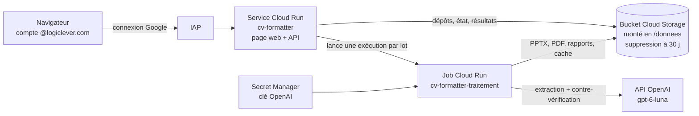

# Déploiement sur Google Cloud Run

Version en ligne du CV Formatter : l'équipe commerciale ouvre une adresse web, se connecte avec son compte
Google Logiclever, dépose les CV et télécharge les PDF et PowerPoint. Rien à installer sur les postes.

## Ce que voit l'utilisateur

1. Ouvrir l'adresse du service (affichée à la fin du déploiement) ; connexion Google, comptes **@logiclever.com** uniquement.
2. **Déposer les CV** dans la zone (PDF, Word, images, ou le `.zip` d'un dossier Google Drive) ; choisir la version
   **nominative**, **anonyme** ou **les deux**, et au besoin « Retirer les coordonnées ».
3. **Lancer** : l'avancement s'affiche (lecture, extraction, contre-vérification, mise en page, PDF). On peut fermer
   la page : le traitement continue et le lot reste dans l'**Historique**.
4. **Résultats** : pour chaque CV, le PDF (aperçu dans le navigateur), le PowerPoint, le JSON (contenu du CV tel qu'affiché), le CV d'origine et le détail du contrôle (à
   vérifier, retiré, remarques) ; **Tout télécharger (.zip)** donne les fichiers rangés par version avec les rapports, et les CV déposés (« CV d'origine »).

Les lots sont supprimés automatiquement au bout de 30 jours.

## Architecture



| Élément | Rôle | Réglage |
|---|---|---|
| Service `cv-formatter` | page web, dépôt des fichiers, suivi, téléchargements | 1 vCPU, 512 Mio, 0 à 2 instances (rien ne tourne quand personne ne s'en sert) |
| Job `cv-formatter-traitement` | traite un lot : même programme que la version Windows | 1 vCPU, 2 Gio, 1 h maximum, 1 nouvel essai en cas d'échec |
| Bucket `<projet>-cv-formatter` | lots (`lots/<id>/…`) et cache des extractions (`cache/<empreinte>.json`) | Paris, accès public interdit, **suppression automatique après 30 jours** |
| IAP | réserve l'accès aux comptes du domaine | gratuit, sans équilibreur de charge |
| Secret Manager | clé OpenAI, lisible par le job seul | le service web n'y a pas accès |

Une seule image Docker pour le service et le job. Sous Linux, le PDF est produit par LibreOffice, **calé sur le
rendu de PowerPoint** (voir README principal, « Rendu PDF sous Linux ») ; le PowerPoint livré embarque les polices
Lexend complètes, comme sous Windows.

Le cache des extractions est partagé : un CV déjà traité (même fichier) n'est pas renvoyé à OpenAI, ce qui rend
gratuite la version anonyme d'un CV déjà formaté.

## Coût

Tout s'arrête quand personne ne s'en sert (aucune instance permanente, pas d'équilibreur de charge). Région
**europe-west9 (Paris)**, tarif « Tier 1 » (le moins cher), données en France.

| Poste | Estimation pour 200 CV par mois |
|---|---|
| Job (≈ 3 min par lot de 5 CV, 1 vCPU / 2 Gio) | 0 € : dans la part gratuite mensuelle de Cloud Run (240 000 vCPU-s) |
| Service web | 0 € : part gratuite (180 000 vCPU-s, 2 millions de requêtes) |
| Stockage (≈ 0,4 Go, 30 jours) et opérations | ≈ 0,02 € |
| Images (2 versions ≈ 0,35 Go, couches communes) | 0 € : part gratuite de 0,5 Go |
| Cloud Build (≈ 6 min la première fois, 1 à 2 min ensuite) | 0 € : 2 500 min gratuites par mois |
| IAP, Secret Manager, journaux | 0 € |
| **API OpenAI (gpt-6-luna)** | **≈ 0,01 $ par CV, soit ≈ 2 $** — le seul vrai coût |

## Prérequis

- Un projet Google Cloud **rattaché à l'organisation Logiclever** (sinon IAP n'accepte que des comptes de
  l'organisation du projet : voir Dépannage), avec la **facturation activée**.
- Être **Propriétaire** du projet (création des comptes de service et des droits).
- La clé API OpenAI.

## Déployer (une première fois, puis à chaque nouvelle version)

Dans [Cloud Shell](https://shell.cloud.google.com) (gratuit, `gcloud` déjà installé) :

```bash
git clone https://github.com/mhmedammara/CV-formatter-LL.git
cd CV-formatter-LL
git checkout deploiement-cloud-run
gcloud config set project MON-PROJET
bash deploiement/deployer.sh
```

Le script active les API, crée le dépôt d'images, construit l'image (≈ 6 min la première fois ; ensuite 1 à 2 min, les couches LibreOffice et Python étant reprises de l'image précédente), crée le bucket et sa règle de
suppression, demande la clé OpenAI (une seule fois, saisie masquée, stockée dans Secret Manager), crée les deux
comptes de service et leurs droits, déploie le job puis le service, et réserve l'accès au domaine. Il affiche
l'adresse à donner à l'équipe.

Paramètres facultatifs : `REGION=… DOMAINE=… BUCKET=… RETENTION=… bash deploiement/deployer.sh` (`RETENTION=0` : conservation sans limite ; à relancer avec la même valeur à chaque mise à jour).

**Mettre à jour** : `git pull` puis relancer `bash deploiement/deployer.sh` (les éléments existants sont
conservés ; seule l'image change).

## Gérer les accès

Tout le domaine est autorisé par défaut. Pour n'ouvrir l'accès qu'à certaines personnes ou à un groupe :

```bash
gcloud iap web remove-iam-policy-binding --region europe-west9 --resource-type cloud-run --service cv-formatter \
  --member domain:logiclever.com --role roles/iap.httpsResourceAccessor
gcloud iap web add-iam-policy-binding --region europe-west9 --resource-type cloud-run --service cv-formatter \
  --member group:commerciaux@logiclever.com --role roles/iap.httpsResourceAccessor   # ou user:prenom.nom@…
```

## Changer la clé OpenAI

```bash
printf '%s' 'sk-…' | gcloud secrets versions add openai-api-key --data-file=-
```

Les lots suivants utilisent la nouvelle clé (le job lit toujours la dernière version).

## Essayer en local (Docker Desktop)

```powershell
docker build -t cv-formatter .
docker run --rm -p 8080:8080 -e OPENAI_API_KEY=sk-… -v "${PWD}/donnees-web:/donnees" cv-formatter
```

Puis <http://localhost:8080>. En local, le traitement tourne dans le même conteneur (pas de job Cloud Run) ;
`donnees-web/` (ignoré par Git) contient les lots et le cache.

## Contrôler le calage du PDF après une mise à jour de l'image

LibreOffice et les polices font partie du rendu : après une mise à jour de l'image de base (`FROM` du Dockerfile),
lancer les tests dans l'image — dont `tests/test_rendu_linux.py`, qui compare chaque ligne des PDF LibreOffice aux
positions de PowerPoint :

```powershell
docker run --rm -v "${PWD}:/app" -w /app cv-formatter sh -c "pip install --user -q pytest httpx && python -m pytest -q"
```

## Supprimer le déploiement

```bash
gcloud run services delete cv-formatter --region europe-west9
gcloud run jobs delete cv-formatter-traitement --region europe-west9
gcloud storage rm --recursive gs://MON-PROJET-cv-formatter
gcloud secrets delete openai-api-key
gcloud artifacts repositories delete cv-formatter --location europe-west9
gcloud iam service-accounts delete cv-formatter-web@MON-PROJET.iam.gserviceaccount.com
gcloud iam service-accounts delete cv-formatter-job@MON-PROJET.iam.gserviceaccount.com
```

## Dépannage

| Symptôme | Cause probable et solution |
|---|---|
| `gcloud builds submit` : permission refusée | Projet récent : le compte de Cloud Build n'a pas les droits. `gcloud projects add-iam-policy-binding MON-PROJET --member serviceAccount:NUMERO-compute@developer.gserviceaccount.com --role roles/cloudbuild.builds.builder`, puis relancer le script. |
| « Accès refusé » à l'ouverture de la page | Compte Google hors domaine, ou mauvais compte connecté dans le navigateur ; vérifier `gcloud iap web get-iam-policy --region europe-west9 --resource-type cloud-run --service cv-formatter`. |
| Collègues refusés alors qu'ils sont @logiclever.com | Projet hors de l'organisation Logiclever : déplacer le projet dans l'organisation, ou configurer un client OAuth personnalisé pour IAP (documentation « Enable IAP for Cloud Run », accès hors organisation). |
| Un lot reste sur « Démarrage du traitement » | `gcloud run jobs executions list --job cv-formatter-traitement --region europe-west9`, puis les journaux de l'exécution dans la console (Cloud Run > Jobs). La page signale un lot sans nouvelles depuis 15 minutes. |
| « clé OpenAI absente » dans le rapport | Secret vide ou non lisible par le job : `gcloud secrets versions list openai-api-key`. |
| PDF absent pour un CV | Le rapport donne la raison (« PDF non généré : … ») ; le PowerPoint est livré quand même. |
